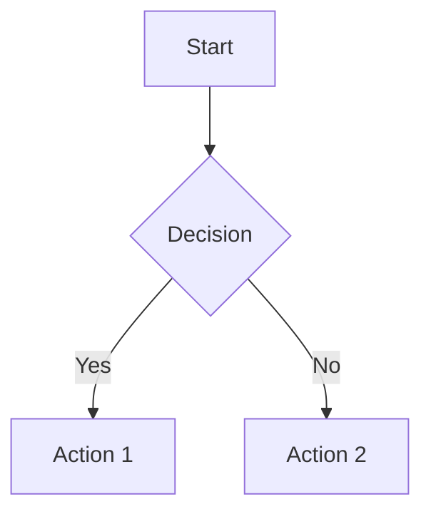

# Level 1: Main Heading

> [!NOTE]  
> This is a GitBook callout. It supports `NOTE`, `WARNING`, `TIP`, and `DANGER`.

## Level 2: Tables

### Level 3: Basic Table

| Syntax      | Description |
|-------------|-------------|
| Header      | Title       |
| Paragraph   | Text        |

### Level 3: Aligned Table (GitBook supports this)
| Left-Aligned | Center-Aligned | Right-Aligned |
|:-------------|:--------------:|--------------:|
| Cell A       | Cell B         | Cell C        |
| `code`       | **bold**       | *italic*      |

---

## Level 2: Mermaid Diagrams

### Level 3: Flowchart

