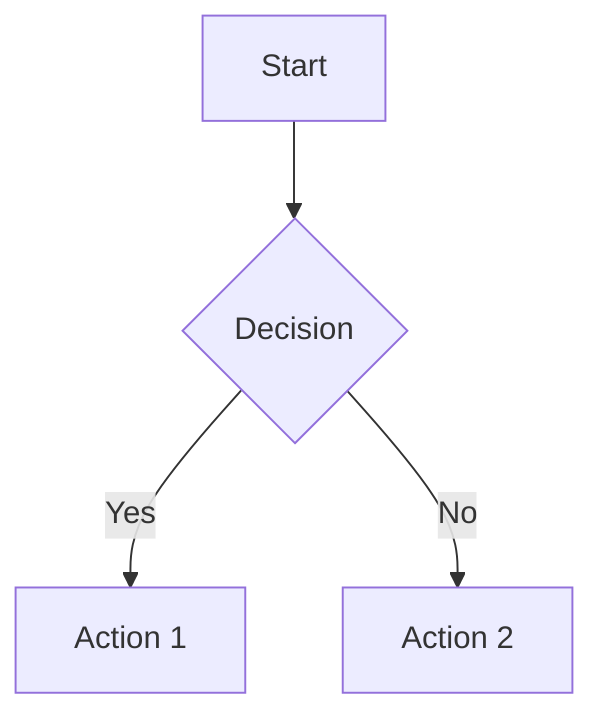

# Level 1: Main Heading

## Level 2: Tables

### Level 3: Basic Table

| Syntax    | Description |
| --------- | ----------- |
| Header    | Title       |
| Paragraph | Text        |

### Level 3: Aligned Table (GitBook supports this)

| Left-Aligned | Center-Aligned | Right-Aligned |
| :----------- | :------------: | ------------: |
| Cell A       |     Cell B     |        Cell C |
| `code`       |    **bold**    |      _italic_ |

### Table from xml

<table>
    <tr>
        <th>A</th>
        <th>B</th>
        <th>C</th>
    </tr>
    <tr>
        <td>1</td>
        <td>2</td>
        <td>3</td>
    </tr>
    <tr>
        <td>4</td>
        <td>5</td>
        <td>6</td>
    </tr>
    <tr>
        <td>7</td>
        <td>8</td>
        <td>9</td>
    </tr>
</table>

---

## Level 2: Mermaid Diagrams

### Level 3: Flowchart

# Testing rich-qoutes....

It should be easy to annotate:

**Info** Info

**Note** Note

**Tag** Tag

**Comment** Comment

**Hint** Hint

**Success** Success

**Warning** Warning

**Caution** Caution

**Danger** Danger

**Quote** Quote

# Links

- [Creating content - GitBook](https://gitbook.com/docs/creating-content/formatting)

- Added [richqoutes](https://github.com/erixtekila/gitbook-plugin-richquotes)
