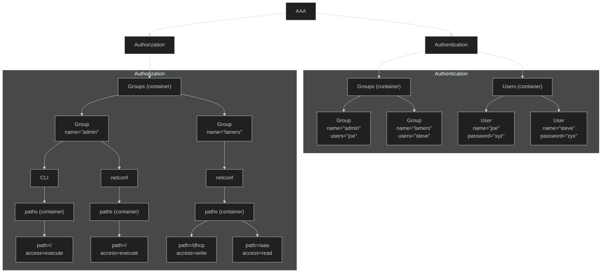

# Mermaid digrams

During a recent AI-course AI, the topic or re-factoring came up.
Specifically to convert images or drawing to mermaid-syntax.

So I took that opertunity to:

1. Give Gemini an image
2. Ask it to convert it to mermaid syntax

## Result

## Experience

Great! That saves us a lot of time - and we do not have to ask a junior to do
this for us.

The result is pretty good, and other advantages - such as diffing the code
become easier this way.

## GitBook

- An example in the GitBook-docs itself would not hurt anyone... ;)

- Dark-mode - would really be nice ( if it worked in GitBook).

## Admonitions

You need to use hints... not very pretty...


**Info hints** are great for showing general information, or providing tips and tricks.



**Success hints** are good for showing positive actions or achievements.



**Warning hints** are good for showing important information or non-critical warnings.



**Danger hints** are good for highlighting destructive actions or raising attention to critical information.


## Links

- [Mermaid Gitbook Examples](https://raw.githubusercontent.com/mermaidjs/mermaid-gitbook)